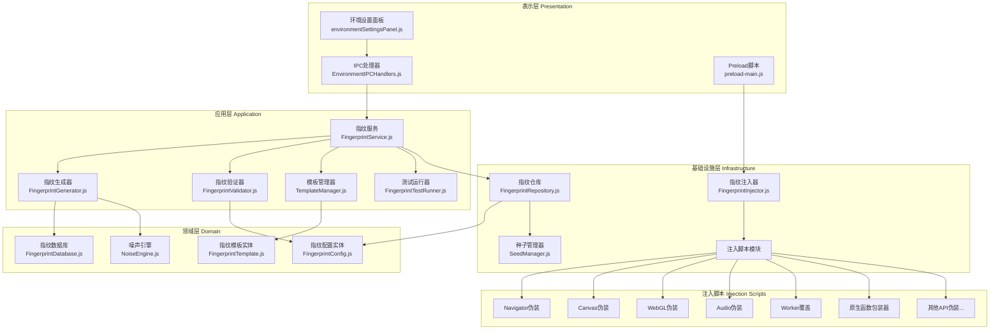

# 设计文档

## 概述

本设计文档描述专业级浏览器指纹系统的技术架构和实现方案。系统将对标业界领先的指纹浏览器（Multilogin、GoLogin、AdsPower等），实现完整的指纹维度覆盖，并直接集成到现有项目架构中。

系统采用分层架构，包含54个需求的完整实现，特别关注：
- 原生函数伪装的透明性
- Worker/Service Worker的完整覆盖
- 噪声模型的数学正确性
- 真实指纹数据库的合规性
- 反检测回归测试

## 架构

### 整体架构图



### 目录结构

```
src/
├── domain/
│   └── fingerprint/
│       ├── FingerprintConfig.js      # 指纹配置实体
│       ├── FingerprintTemplate.js    # 指纹模板实体
│       ├── FingerprintDatabase.js    # 真实指纹数据库
│       ├── NoiseEngine.js            # 噪声引擎
│       └── index.js
├── application/
│   └── services/
│       └── fingerprint/
│           ├── FingerprintService.js    # 指纹服务
│           ├── FingerprintGenerator.js  # 指纹生成器
│           ├── FingerprintValidator.js  # 指纹验证器
│           ├── TemplateManager.js       # 模板管理器
│           ├── FingerprintTestRunner.js # 测试运行器
│           └── index.js
├── infrastructure/
│   └── fingerprint/
│       ├── FingerprintRepository.js  # 指纹仓库
│       ├── FingerprintInjector.js    # 指纹注入器
│       ├── SeedManager.js            # 种子安全管理器
│       └── injection-scripts/        # 注入脚本模块
│           ├── core/
│           │   ├── native-wrapper.js     # 原生函数包装器
│           │   ├── prototype-guard.js    # 原型链保护
│           │   └── worker-interceptor.js # Worker拦截器
│           ├── navigator.js          # Navigator伪装
│           ├── canvas.js             # Canvas伪装
│           ├── webgl.js              # WebGL伪装
│           ├── audio.js              # Audio伪装
│           ├── fonts.js              # 字体伪装
│           ├── webrtc.js             # WebRTC保护
│           ├── clientrects.js        # ClientRects伪装
│           ├── timezone.js           # 时区伪装
│           ├── geolocation.js        # 地理位置伪装
│           ├── media-devices.js      # 媒体设备保护
│           ├── battery.js            # 电池API保护
│           ├── sensors.js            # 传感器保护
│           ├── speech.js             # Speech API保护
│           ├── permissions.js        # Permissions API伪装
│           ├── storage.js            # Storage API保护
│           ├── connection.js         # Connection API伪装
│           ├── keyboard.js           # Keyboard API保护
│           ├── performance.js        # Performance API保护
│           ├── advanced-apis.js      # 高级API保护
│           ├── browser-behavior.js   # 浏览器行为一致性
│           └── index.js              # 脚本聚合
├── presentation/
│   └── ipc/
│       └── handlers/
│           └── EnvironmentIPCHandlers.js  # 扩展指纹IPC
├── single-window/
│   └── renderer/
│       └── environmentSettingsPanel.js    # 扩展指纹UI
└── test/
    └── fingerprint/
        ├── detection-tests/          # 反检测测试
        │   ├── browserleaks.test.js
        │   ├── pixelscan.test.js
        │   ├── prototype-chain.test.js
        │   └── function-string.test.js
        └── performance/              # 性能测试
            └── benchmark.test.js
```

## 组件和接口

### 1. NativeWrapper（原生函数包装器）- 核心组件

```javascript
/**
 * 原生函数包装器
 * 使用透明代理技术包装原生函数，保持原生特征
 * 
 * 关键技术：
 * 1. 保留原始函数引用
 * 2. 使用Proxy实现透明包装
 * 3. 正确处理toString/toSource
 * 4. 保持属性描述符一致性
 */
class NativeWrapper {
  /**
   * 包装原生函数
   * @param {Function} originalFn - 原始函数
   * @param {Function} wrapperFn - 包装逻辑
   * @param {Object} options - 配置选项
   * @returns {Function} 包装后的函数
   */
  static wrap(originalFn, wrapperFn, options = {}) {
    const wrapped = function(...args) {
      return wrapperFn.call(this, originalFn, args);
    };
    
    // 保持原生函数特征
    Object.defineProperty(wrapped, 'name', {
      value: originalFn.name,
      configurable: true
    });
    
    Object.defineProperty(wrapped, 'length', {
      value: originalFn.length,
      configurable: true
    });
    
    // 关键：覆盖toString返回原生代码
    const nativeToString = `function ${originalFn.name}() { [native code] }`;
    wrapped.toString = () => nativeToString;
    wrapped.toSource = () => nativeToString;
    
    // 保存原始函数引用（用于内部调用）
    wrapped.__original__ = originalFn;
    
    return wrapped;
  }
  
  /**
   * 保护原型链
   * 确保被覆盖的方法在原型链遍历时表现正常
   */
  static protectPrototype(proto, methodName, wrappedFn) {
    const descriptor = Object.getOwnPropertyDescriptor(proto, methodName);
    
    Object.defineProperty(proto, methodName, {
      value: wrappedFn,
      writable: descriptor?.writable ?? true,
      enumerable: descriptor?.enumerable ?? false,
      configurable: descriptor?.configurable ?? true
    });
  }
}
```

### 2. WorkerInterceptor（Worker拦截器）

```javascript
/**
 * Worker拦截器
 * 拦截所有Worker创建并注入指纹覆盖
 */
class WorkerInterceptor {
  constructor(fingerprintConfig) {
    this.config = fingerprintConfig;
    this.injectionScript = null;
  }
  
  /**
   * 初始化Worker拦截
   */
  initialize() {
    this.interceptWebWorker();
    this.interceptSharedWorker();
    this.interceptServiceWorker();
  }
  
  /**
   * 拦截Web Worker
   */
  interceptWebWorker() {
    const OriginalWorker = window.Worker;
    const self = this;
    
    window.Worker = NativeWrapper.wrap(OriginalWorker, function(original, args) {
      const [scriptURL, options] = args;
      
      // 创建包含注入脚本的Blob
      const injectedScript = self.createInjectedWorkerScript(scriptURL);
      const blob = new Blob([injectedScript], { type: 'application/javascript' });
      const blobURL = URL.createObjectURL(blob);
      
      return new original(blobURL, options);
    });
  }
  
  /**
   * 拦截Service Worker注册
   */
  interceptServiceWorker() {
    if (!navigator.serviceWorker) return;
    
    const originalRegister = navigator.serviceWorker.register;
    const self = this;
    
    navigator.serviceWorker.register = NativeWrapper.wrap(
      originalRegister,
      async function(original, args) {
        const [scriptURL, options] = args;
        // 在注册前注入指纹覆盖
        // 注意：Service Worker有独立源上下文，需要特殊处理
        return original.call(navigator.serviceWorker, scriptURL, options);
      }
    );
  }
  
  /**
   * 创建注入后的Worker脚本
   */
  createInjectedWorkerScript(originalURL) {
    return `
      // 指纹覆盖脚本
      ${this.injectionScript}
      
      // 导入原始脚本
      importScripts('${originalURL}');
    `;
  }
}
```

### 3. NoiseEngine（噪声引擎）

```javascript
/**
 * 噪声引擎
 * 提供确定性噪声生成，支持多种分布和强度级别
 */
class NoiseEngine {
  /**
   * 噪声强度级别
   */
  static LEVELS = {
    OFF: 'off',
    LOW: 'low',       // 微小噪声，几乎不可见
    MEDIUM: 'medium', // 中等噪声，改变指纹但不影响视觉
    HIGH: 'high'      // 高噪声，明显改变输出
  };
  
  /**
   * 噪声分布类型
   */
  static DISTRIBUTIONS = {
    UNIFORM: 'uniform',   // 均匀分布
    GAUSSIAN: 'gaussian'  // 高斯分布
  };
  
  constructor(seed, options = {}) {
    this.seed = seed;
    this.level = options.level || NoiseEngine.LEVELS.MEDIUM;
    this.distribution = options.distribution || NoiseEngine.DISTRIBUTIONS.UNIFORM;
    this.rng = this.createSeededRNG(seed);
  }
  
  /**
   * 创建种子随机数生成器（确定性）
   */
  createSeededRNG(seed) {
    // 使用Mulberry32算法
    return function() {
      let t = seed += 0x6D2B79F5;
      t = Math.imul(t ^ t >>> 15, t | 1);
      t ^= t + Math.imul(t ^ t >>> 7, t | 61);
      return ((t ^ t >>> 14) >>> 0) / 4294967296;
    };
  }
  
  /**
   * 获取噪声值
   * @param {number} index - 数据索引（用于确定性）
   * @returns {number} 噪声值
   */
  getNoise(index) {
    // 基于索引生成确定性噪声
    const baseNoise = this.rng();
    
    // 根据分布类型调整
    let noise;
    if (this.distribution === NoiseEngine.DISTRIBUTIONS.GAUSSIAN) {
      // Box-Muller变换生成高斯分布
      const u1 = this.rng();
      const u2 = this.rng();
      noise = Math.sqrt(-2 * Math.log(u1)) * Math.cos(2 * Math.PI * u2);
    } else {
      noise = baseNoise * 2 - 1; // [-1, 1]
    }
    
    // 根据强度级别缩放
    const scale = this.getScaleForLevel();
    return noise * scale;
  }
  
  /**
   * 获取强度级别对应的缩放因子
   */
  getScaleForLevel() {
    switch (this.level) {
      case NoiseEngine.LEVELS.OFF: return 0;
      case NoiseEngine.LEVELS.LOW: return 0.5;
      case NoiseEngine.LEVELS.MEDIUM: return 2;
      case NoiseEngine.LEVELS.HIGH: return 5;
      default: return 2;
    }
  }
  
  /**
   * 应用噪声到Canvas像素数据
   */
  applyToCanvasData(imageData) {
    if (this.level === NoiseEngine.LEVELS.OFF) return imageData;
    
    const data = imageData.data;
    for (let i = 0; i < data.length; i += 4) {
      const noise = this.getNoise(i);
      data[i] = Math.max(0, Math.min(255, data[i] + noise));     // R
      data[i+1] = Math.max(0, Math.min(255, data[i+1] + noise)); // G
      data[i+2] = Math.max(0, Math.min(255, data[i+2] + noise)); // B
      // Alpha通道不修改
    }
    return imageData;
  }
  
  /**
   * 应用噪声到Audio数据
   */
  applyToAudioData(channelData) {
    if (this.level === NoiseEngine.LEVELS.OFF) return channelData;
    
    const scale = this.getScaleForLevel() * 0.0001; // Audio需要更小的噪声
    for (let i = 0; i < channelData.length; i++) {
      channelData[i] += this.getNoise(i) * scale;
    }
    return channelData;
  }
}
```

### 4. SeedManager（种子安全管理器）

```javascript
/**
 * 种子安全管理器
 * 安全生成、存储和管理噪声种子
 */
class SeedManager {
  constructor(encryptionKey) {
    this.encryptionKey = encryptionKey;
  }
  
  /**
   * 生成加密安全的种子
   */
  generateSecureSeed() {
    const array = new Uint32Array(1);
    crypto.getRandomValues(array);
    return array[0];
  }
  
  /**
   * 加密存储种子
   */
  async encryptSeed(seed, accountId) {
    const data = JSON.stringify({ seed, accountId, version: 1 });
    // 使用AES-GCM加密
    const encoder = new TextEncoder();
    const iv = crypto.getRandomValues(new Uint8Array(12));
    const encrypted = await crypto.subtle.encrypt(
      { name: 'AES-GCM', iv },
      this.encryptionKey,
      encoder.encode(data)
    );
    return { iv: Array.from(iv), data: Array.from(new Uint8Array(encrypted)) };
  }
  
  /**
   * 解密种子
   */
  async decryptSeed(encryptedData) {
    const iv = new Uint8Array(encryptedData.iv);
    const data = new Uint8Array(encryptedData.data);
    const decrypted = await crypto.subtle.decrypt(
      { name: 'AES-GCM', iv },
      this.encryptionKey,
      data
    );
    const decoder = new TextDecoder();
    return JSON.parse(decoder.decode(decrypted));
  }
  
  /**
   * 轮换种子
   */
  async rotateSeed(accountId, oldSeed) {
    const newSeed = this.generateSecureSeed();
    // 记录轮换历史（用于审计）
    return {
      newSeed,
      rotatedAt: new Date().toISOString(),
      previousSeedHash: this.hashSeed(oldSeed)
    };
  }
  
  /**
   * 哈希种子（用于日志，不暴露原始值）
   */
  hashSeed(seed) {
    // 简单哈希，实际应使用SHA-256
    return (seed * 2654435761 >>> 0).toString(16);
  }
}
```

### 5. FingerprintTestRunner（测试运行器）

```javascript
/**
 * 指纹测试运行器
 * 运行反检测测试并生成报告
 */
class FingerprintTestRunner {
  constructor() {
    this.tests = [];
    this.results = [];
  }
  
  /**
   * 注册测试
   */
  registerTest(name, testFn) {
    this.tests.push({ name, testFn });
  }
  
  /**
   * 运行所有测试
   */
  async runAll(config) {
    this.results = [];
    
    for (const test of this.tests) {
      try {
        const result = await test.testFn(config);
        this.results.push({
          name: test.name,
          passed: result.passed,
          expected: result.expected,
          actual: result.actual,
          details: result.details
        });
      } catch (error) {
        this.results.push({
          name: test.name,
          passed: false,
          error: error.message
        });
      }
    }
    
    return this.generateReport();
  }
  
  /**
   * 生成测试报告
   */
  generateReport() {
    const passed = this.results.filter(r => r.passed).length;
    const failed = this.results.filter(r => !r.passed).length;
    
    return {
      summary: {
        total: this.results.length,
        passed,
        failed,
        passRate: (passed / this.results.length * 100).toFixed(2) + '%'
      },
      results: this.results,
      timestamp: new Date().toISOString()
    };
  }
  
  /**
   * 内置测试：原型链检测
   */
  static prototypeChainTest(config) {
    const tests = [
      () => navigator.userAgent.toString() === config.userAgent,
      () => typeof navigator.userAgent === 'string',
      () => !navigator.userAgent.hasOwnProperty('__original__')
    ];
    
    return {
      passed: tests.every(t => t()),
      expected: 'All prototype chain checks pass',
      actual: tests.map(t => t())
    };
  }
  
  /**
   * 内置测试：函数字符串化检测
   */
  static functionStringTest() {
    const fnString = navigator.userAgent.toString.toString();
    const isNative = fnString.includes('[native code]');
    
    return {
      passed: isNative,
      expected: 'function toString() { [native code] }',
      actual: fnString
    };
  }
}
```


## 数据模型

### FingerprintConfig完整结构

```javascript
{
  // 元数据
  id: "uuid",
  accountId: "account-uuid",
  createdAt: "2024-01-01T00:00:00Z",
  updatedAt: "2024-01-01T00:00:00Z",
  version: "1.0.0",
  
  // 浏览器配置
  browser: {
    type: "chrome",           // chrome, firefox, edge, safari
    version: "120.0.0.0",
    majorVersion: 120
  },
  
  // 操作系统配置
  os: {
    type: "windows",          // windows, macos, linux
    version: "10.0",
    platform: "Win32"         // Win32, MacIntel, Linux x86_64
  },
  
  // User-Agent
  userAgent: "Mozilla/5.0 (Windows NT 10.0; Win64; x64) AppleWebKit/537.36...",
  
  // Navigator属性
  navigator: {
    appVersion: "5.0 (Windows NT 10.0; Win64; x64)...",
    vendor: "Google Inc.",
    product: "Gecko",
    productSub: "20030107",
    appName: "Netscape",
    appCodeName: "Mozilla",
    language: "en-US",
    languages: ["en-US", "en"],
    doNotTrack: null,
    globalPrivacyControl: false,
    webdriver: false
  },
  
  // 硬件信息
  hardware: {
    cpuCores: 8,
    deviceMemory: 8,
    maxTouchPoints: 0,
    screen: {
      width: 1920,
      height: 1080,
      availWidth: 1920,
      availHeight: 1040,
      colorDepth: 24,
      pixelDepth: 24
    },
    devicePixelRatio: 1
  },
  
  // Canvas配置
  canvas: {
    mode: "noise",            // noise, real, off
    noiseLevel: "medium",     // off, low, medium, high
    noiseDistribution: "uniform" // uniform, gaussian
  },
  
  // WebGL配置
  webgl: {
    mode: "custom",
    vendor: "Google Inc. (Intel)",
    renderer: "ANGLE (Intel, Intel(R) UHD Graphics Direct3D11 vs_5_0 ps_5_0)",
    unmaskedVendor: "Intel Inc.",
    unmaskedRenderer: "Intel(R) UHD Graphics",
    extensions: ["ANGLE_instanced_arrays", "EXT_blend_minmax"],
    shaderPrecision: { /* ... */ },
    imageNoise: true,
    noiseLevel: "medium"
  },
  
  // Audio配置
  audio: {
    mode: "noise",
    noiseLevel: "medium",
    noiseDistribution: "uniform"
  },
  
  // 字体配置
  fonts: {
    mode: "custom",
    list: ["Arial", "Helvetica", "Times New Roman"]
  },
  
  // 插件配置
  plugins: {
    mode: "custom",
    list: [
      { name: "Chrome PDF Plugin", filename: "internal-pdf-viewer", description: "Portable Document Format" }
    ]
  },
  
  // 语言配置
  language: {
    mode: "custom",
    primary: "en-US",
    list: ["en-US", "en"]
  },
  
  // 时区配置
  timezone: {
    mode: "custom",
    name: "America/New_York",
    offset: -300
  },
  
  // 地理位置配置
  geolocation: {
    mode: "custom",
    latitude: 40.7128,
    longitude: -74.0060,
    accuracy: 100
  },
  
  // WebRTC配置
  webrtc: {
    mode: "replace",
    publicIP: "auto",
    localIP: "192.168.1.100",
    whitelist: ["meet.google.com", "zoom.us"]  // per-origin白名单
  },
  
  // ClientRects配置
  clientRects: {
    mode: "noise",
    noiseLevel: "low"
  },
  
  // 媒体设备配置
  mediaDevices: {
    mode: "fake",
    devices: [
      { kind: "audioinput", deviceId: "default", label: "Default Audio Device" }
    ]
  },
  
  // 电池配置
  battery: {
    mode: "privacy",
    charging: true,
    level: 1.0
  },
  
  // 传感器配置
  sensors: {
    mode: "disable"
  },
  
  // Speech配置
  speech: {
    mode: "minimal",
    voices: [{ name: "Microsoft David Desktop", lang: "en-US" }]
  },
  
  // 隐私设置
  privacy: {
    doNotTrack: null,
    globalPrivacyControl: false
  },
  
  // 高级API配置
  advancedApis: {
    permissions: { mode: "custom" },
    storage: { mode: "fake", quota: 10737418240 },
    connection: { mode: "custom", effectiveType: "4g", downlink: 10, rtt: 50 },
    keyboard: { mode: "standard" },
    performance: { mode: "noise", precision: 100 },
    pdf: { enabled: true },
    bluetooth: { enabled: false },
    usb: { enabled: false },
    gamepad: { mode: "hide" },
    history: { mode: "minimal", length: 1 },
    clipboard: { mode: "ask" },
    notification: { mode: "deny" },
    serviceWorker: { enabled: true },
    webAssembly: { enabled: true },
    sharedArrayBuffer: { enabled: false },
    credentials: { enabled: false },
    payment: { enabled: false },
    presentation: { enabled: false }
  },
  
  // 噪声种子（加密存储）
  noiseSeed: {
    encrypted: true,
    iv: [/* ... */],
    data: [/* ... */]
  },
  
  // 种子版本（用于轮换）
  seedVersion: 1,
  seedRotatedAt: null
}
```

## 正确性属性

*属性是系统在所有有效执行中应保持为真的特征或行为——本质上是关于系统应该做什么的正式声明。属性作为人类可读规范和机器可验证正确性保证之间的桥梁。*

### 属性1：指纹配置序列化往返一致性
*对于任何*有效的FingerprintConfig对象，序列化为JSON后再反序列化，应产生与原始对象等效的配置。
**验证: 需求 2.5**

### 属性2：新账号指纹唯一性
*对于任何*新创建的账号，系统生成的指纹配置应具有唯一的ID和噪声种子。
**验证: 需求 2.1**

### 属性3：无效配置拒绝
*对于任何*包含无效数据的指纹配置（如无效的CPU核心数、不存在的浏览器类型等），验证器应拒绝该配置并返回具体错误信息。
**验证: 需求 2.7**

### 属性4：Canvas噪声确定性
*对于任何*给定的噪声种子和Canvas操作，多次执行应产生完全相同的输出结果。
**验证: 需求 5.4**

### 属性5：不同账号Canvas噪声唯一性
*对于任何*两个具有不同噪声种子的账号，执行相同的Canvas操作应产生不同的输出结果。
**验证: 需求 5.5**

### 属性6：生成指纹内部一致性
*对于任何*生成的指纹配置，User-Agent中的操作系统信息应与platform属性匹配，WebGL渲染器应与操作系统兼容。
**验证: 需求 20.2, 29.1, 29.2**

### 属性7：多次生成指纹唯一性
*对于任何*连续多次调用指纹生成器，每次生成的指纹配置应具有不同的噪声种子和唯一标识。
**验证: 需求 20.7**

### 属性8：模板导出导入往返一致性
*对于任何*有效的指纹模板，导出为JSON后再导入，应产生与原始模板等效的配置。
**验证: 需求 21.3, 21.4**

### 属性9：Navigator属性注入正确性
*对于任何*指纹配置，注入后访问navigator.userAgent应返回配置中指定的User-Agent字符串。
**验证: 需求 3.1**

### 属性10：被覆盖API原生函数特征
*对于任何*被指纹系统覆盖的API函数，调用其toString()方法应返回包含"[native code]"的字符串。
**验证: 需求 28.4, 28.5**

### 属性11：User-Agent与平台一致性验证
*对于任何*指纹配置，如果User-Agent包含"Windows"，则platform应为"Win32"；如果包含"Macintosh"，则platform应为"MacIntel"。
**验证: 需求 29.1**

### 属性12：WebGL与操作系统兼容性验证
*对于任何*指纹配置，WebGL渲染器字符串应与配置的操作系统兼容。
**验证: 需求 29.2**

### 属性13：字体列表与操作系统匹配性验证
*对于任何*指纹配置，字体列表应包含配置操作系统的常见系统字体。
**验证: 需求 29.4**

### 属性14：指纹注入性能
*对于任何*指纹配置，注入脚本的生成和执行应在50毫秒内完成。
**验证: 需求 25.1**

### 属性15：噪声种子加密安全性
*对于任何*存储的噪声种子，应使用加密存储，且无法从存储数据直接获取原始种子值。
**验证: 需求 51.2**

### 属性16：Worker环境指纹一致性
*对于任何*在Worker中执行的指纹检测，应返回与主线程相同的伪装值。
**验证: 需求 30.5**

## 错误处理

### 错误类型

```javascript
class FingerprintError extends Error {
  constructor(message, code, details = {}) {
    super(message);
    this.name = 'FingerprintError';
    this.code = code;
    this.details = details;
  }
}

class FingerprintValidationError extends FingerprintError { /* ... */ }
class FingerprintInconsistencyError extends FingerprintError { /* ... */ }
class FingerprintInjectionError extends FingerprintError { /* ... */ }
class FingerprintTemplateError extends FingerprintError { /* ... */ }
class FingerprintSeedError extends FingerprintError { /* ... */ }
```

### 错误处理策略

1. **配置验证失败**: 返回详细的验证错误列表，UI显示具体字段错误
2. **配置不一致**: 返回不一致项列表和修复建议，允许用户选择自动修复
3. **注入失败**: 记录错误日志，继续使用默认浏览器行为，通知用户
4. **种子操作失败**: 生成新种子并记录警告，确保系统可用性

## 测试策略

### 单元测试
- 使用Jest测试框架
- 测试所有核心类的方法
- 测试边界条件和错误处理

### 属性测试
- 使用fast-check库进行属性测试
- 每个属性测试运行至少100次迭代
- 测试标注格式: `**Feature: professional-fingerprint-refactoring, Property {number}: {property_text}**`

### 反检测回归测试
- browserleaks类检测脚本
- pixelscan类检测脚本
- 原型链遍历检测
- 函数字符串化检测
- 多平台测试（Win/Mac/Linux）

### 性能基准测试
- 注入延迟测试（目标<50ms）
- API调用开销测试（目标<1ms/调用）
- CPU使用率测试（目标<5%增量）
